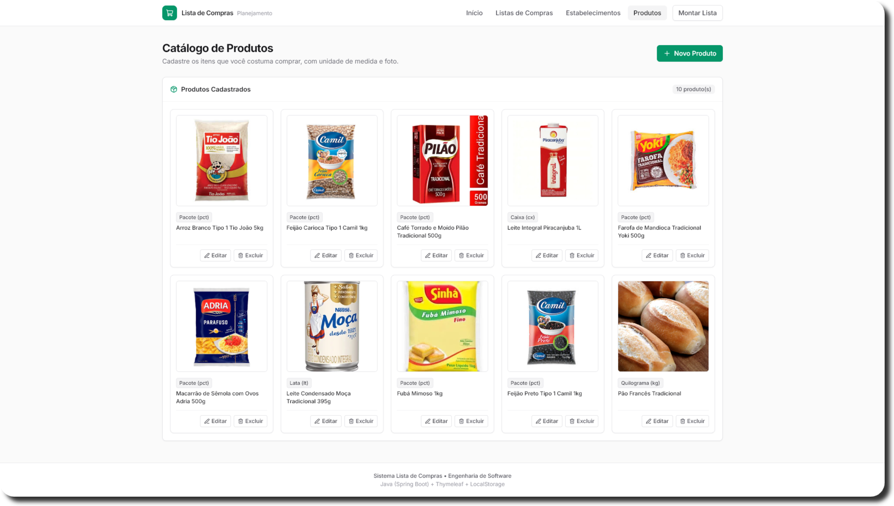

<h2 align="center">
  <div align="center">
    🛒
  </div>

  Lista de Compras

</h2>

<p align="center">
  
  
  
  
  
  
  
</p>

<p align="center"></p>

---

## 🎯 Sobre o Projeto

O **Lista de Compras** é uma aplicação web desenvolvida em linguagem Java utilizando o framework Spring Boot e arquitetura MVC (Model-View-Controller). O sistema foi concebido para auxiliar o usuário no planejamento inteligente das compras do dia a dia, permitindo associar produtos a estabelecimentos específicos e aproveitar os dias em que cada local oferece promoções ou feiras.

Desenvolvido com foco em simplicidade, design limpo com **Tailwind CSS** e operação **100% offline**, o projeto preserva todos os dados diretamente no navegador através de `LocalStorage`, sem a necessidade de banco de dados SQL pesado ou configurações complexas.

---

## 🚀 Principais Recursos

- **📋 Minhas Listas de Compras:** Criação, consulta, renomeação e exclusão de listas organizadas por ocasião (ex: *"Compras do Mês"*, *"Churrasco"*, *"Feira"*).
- **🏪 Estabelecimentos & Dias de Promoção:** Cadastro de supermercados, farmácias e feiras com seleção de múltiplos dias de ofertas da semana (ex: Quarta da Carne, Terça e Quinta do Hortifruti).
- **📦 Catálogo de Produtos Proporcional:** Cadastro de itens com descrição, unidade de medida (`un`, `kg`, `pct`, `cx`, `L`, etc.) e fotos reais sem distorção (proporção quadrada `1:1`). Já inclui 10 itens essenciais pré-cadastrados.
- **🛒 Montagem de Listas & Totalizadores em Tempo Real:** Associação flexível de produtos a listas e estabelecimentos (vínculo de estabelecimento opcional), com cálculo automático e instantâneo de:
  - Quantidade total de itens cadastrados;
  - Somatório de unidades;
  - **Valor total da compra (R$)** estimado com base nos preços unitários informados;
  - Controle de itens comprados/pendentes com marcação visual de status.
- **⚡ Carregamento Fluido com Skeletons:** Estados de transição com animações suaves (`pulse skeletons`) ao carregar dados locais.
- **💾 Persistência Offline:** Inicialização e salvamento imediato no `LocalStorage`, garantindo que nenhum dado seja perdido ao fechar o navegador ou reiniciar a máquina.

---

## 🏛️ Arquitetura & Tecnologias

A aplicação adota o padrão **MVC (Model-View-Controller)** descomplicado:

* **Model:** Classes de domínio puras em Java (`ListaDeCompras.java`, `Estabelecimento.java`, `Produto.java`, `ItemLista.java`).
* **View:** Templates renderizados no servidor com **Thymeleaf**, estruturados com fragmentos reaproveitáveis e estilizados via **Tailwind CSS** com estética moderna e minimalista.
* **Controller:** Controladores Spring MVC (`@Controller`) mapeando rotas semânticas e servindo os dados de contexto.
* **Storage Layer:** Gerenciamento centralizado em JavaScript (`storage.js`), cuidando do CRUD local, validação de campos obrigatórios e cálculos financeiros.

---

## 📦 Como Executar Localmente

### Pré-requisitos
* **Java Development Kit (JDK) 17 ou superior** (testado e homologado no JDK 24).
* Navegador web moderno (Chrome, Edge, Firefox, etc.).

### 1. Clonar o repositório
```bash
git clone https://github.com/Gustavohps10/lista-de-compras.git
cd lista-de-compras
```

### 2. Executar com o Maven Wrapper (Sem necessidade de instalar Maven)

* **No Windows (PowerShell ou CMD):**
  ```powershell
  .\mvnw.cmd spring-boot:run
  ```

* **No Linux ou macOS:**
  ```bash
  ./mvnw spring-boot:run
  ```

### 3. Executar pelo IntelliJ IDEA
1. Abra a pasta do projeto no IntelliJ IDEA.
2. Aguarde a sincronização das dependências do Maven.
3. Navegue até `src/main/java/org/example/ListaDeComprasApplication.java`.
4. Clique com o botão direito no método `main` e selecione **Run 'ListaDeComprasApplication'**.

### 4. Acessar a aplicação
Abra seu navegador e acesse:
👉 **[http://localhost:8080](http://localhost:8080)**

---

## 🗂️ Estrutura do Projeto

```
lista-de-compras/
├── pom.xml                                      # Configuração Spring Boot 3.4.3 & Thymeleaf
├── mvnw.cmd / mvnw                              # Maven Wrapper para execução portátil
├── LICENSE                                      # Licença de código aberto (MIT)
├── README.md                                    # Documentação do projeto
└── src/
    └── main/
        ├── java/org/example/
        │   ├── ListaDeComprasApplication.java   # Ponto de entrada Spring Boot
        │   ├── model/                          # Entidades Java de domínio
        │   │   ├── ListaDeCompras.java
        │   │   ├── Estabelecimento.java
        │   │   ├── Produto.java
        │   │   └── ItemLista.java
        │   └── controller/                     # Controladores Spring MVC
        │       ├── HomeController.java
        │       ├── ListaController.java
        │       ├── EstabelecimentoController.java
        │       ├── ProdutoController.java
        │       └── MontarListaController.java
        └── resources/
            ├── application.properties
            ├── static/js/
            │   └── storage.js                   # Módulo de persistência em LocalStorage
            └── templates/
                ├── fragments/layout.html        # Shell visual, navbar e Tailwind CDN
                ├── index.html                   # Dashboard e menu em 3 colunas
                ├── listas.html                  # Gestão de listas de compras
                ├── estabelecimentos.html        # Gestão de locais e dias de promoção
                ├── produtos.html                # Catálogo de produtos com fotos
                └── montar-lista.html            # Montagem com totalizadores e checklists
```

---

## 📄 Licença

Este projeto está licenciado sob os termos da licença [MIT](./LICENSE).

---

## 👥 Autores

<!-- prettier-ignore-start -->
<!-- markdownlint-disable -->
<table>
  <tbody>
    <tr>
      <td align="center" valign="top" width="33.33%">
        <a href="https://github.com/Gustavohps10">
          <br />
          <sub><b>Gustavo Henrique</b></sub>
        </a><br />
        <a href="https://github.com/Gustavohps10" title="Perfil">💻</a>
      </td>
      <td align="center" valign="top" width="33.33%">
        <a href="https://github.com/joaopedrodorneles">
          <br />
          <sub><b>João Pedro</b></sub>
        </a><br />
        <a href="https://github.com/joaopedrodorneles" title="Perfil">💻</a>
      </td>
      <td align="center" valign="top" width="33.33%">
        <a href="https://github.com/aprendizagemconstantesempre">
          <br />
          <sub><b>Aguinelo</b></sub>
        </a><br />
        <a href="https://github.com/aprendizagemconstantesempre" title="Perfil">💻</a>
      </td>
    </tr>
  </tbody>
</table>
<!-- markdownlint-restore -->
<!-- prettier-ignore-end -->
